# Demostración de habilidades de DevOps

El propósito de este repositorio es demostrar habilidades y conocimiento en DevOps, haciendo uso de herramientas tales como:
- Linux
- Git
- CI/CD Pipelines (GitHub Actions para este repositorio)
- Containers (Docker, Podman, etc.)
- Kubernetes
- Python
- GitOps (Flux)

---

## Estructura de directorios y archivos relevantes

```
devops-demo
├───.github
│   └───workflows
├───api
│   ├───migrations
├───demo 
├───kubernetes 
│    ├───base
│    └───release
├───Containerfile
├───entrypoint.sh
└───requirements.txt
```
- **.github/workflows**: Directorio de pipelines (workflows) de GitHub Actions
- **api**: directorio con código funcional de la API.
- **demo**: directorio con código de configuración de la aplicación (Django App)
- **kubernetes**: directorio con archivos *manifest* y de *kustomize* para desplegar aplicación y requerimientos en *kubernetes*.
- **Containerfile**: archivo para construcción del contenedor.
- **entrypoint.sh**: entrypoint bash script para el contenedor resultante de este repositorio.
- **requirements.txt**: dependencias *python* de la aplicación.


## 🧩 Flujo de trabajo general

1. El desarrollador crea una rama y sube su código a GitHub.
2. El desarrollador debe generar un **Pull Request** (PR).
3. Para el PR, se ejecuta un pipeline que ejecuta las Unit Tests para obtener el Coverage y los resultados son analizados en SonarCloud, tanto para validar el mismo, como otros análisis (malas prácticas, vulnerabilidades, etc.)
4. Cada PR del cuál se haga un merge al branch `main`, que ejecuta las siguientes acciones:
   - Se ejecutan nuevamente las pruebas realizadas para el PR.
   - Se construye y publica una imagen de contenedor en **Github Container Registry (ghcr.io)**.
   - Se generan los manifiestos de Kubernetes basados en la imagen.
   - Se hace push de estos manifiestos a un repositorio separado de GitOps.

---

## 🔁 Diagrama del flujo

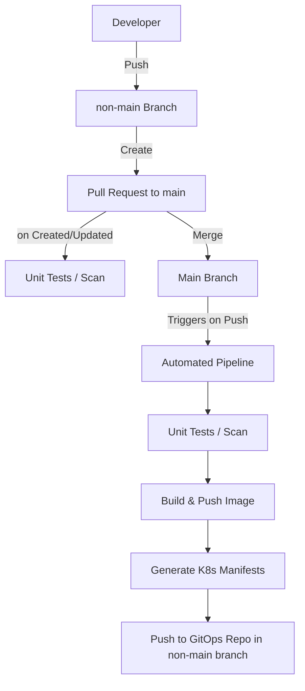

## Despliegue en Kubernetes

Para el despliegue en Kubernetes de este repositorio, se opto por la implementación de GitOps utilizando Flux. Como se observa en el diagrama, una vez se construyen los *kubernetes manifests*, estos son enviados (push) al [repositorio de GitOps](https://github.com/paulorpdldevops-demo-gitops)

En todo caso, se deja a continuación el siguiente diagrama explicativo del proceso de GitOps.

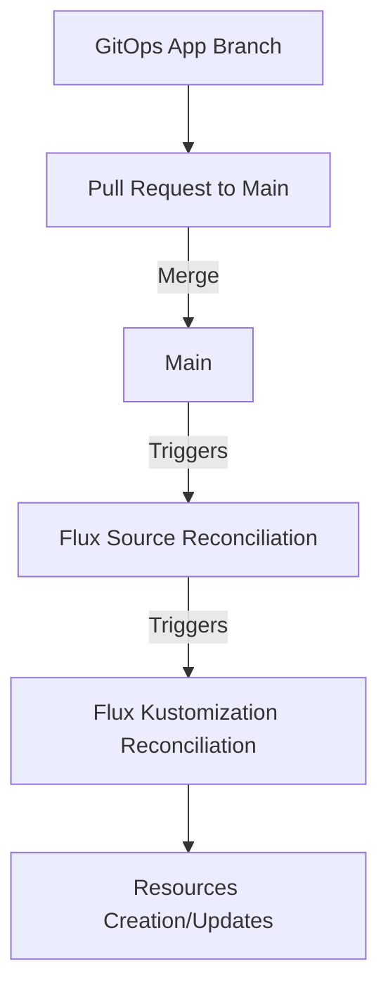

## Demostración de recursos en el clúster

### Recursos de Flux
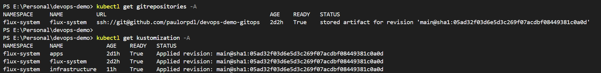

Los recursos de tipo *GitRepository* definen en flux un fuente (*source*) basado en un repositorio *Git* para las sincronizaciones, mientras que los recursos tipo *Kustomization* definen de que ubicación dentro de un *source* se deben desplegar los *manifests* siendo este compatible con los formatos aceptados por *kubectl* (yaml, json) y también brindando compatibilidad de ejecución automática de *kustomize build*.

### Estado de sincronización de directorio de Aplicaciones
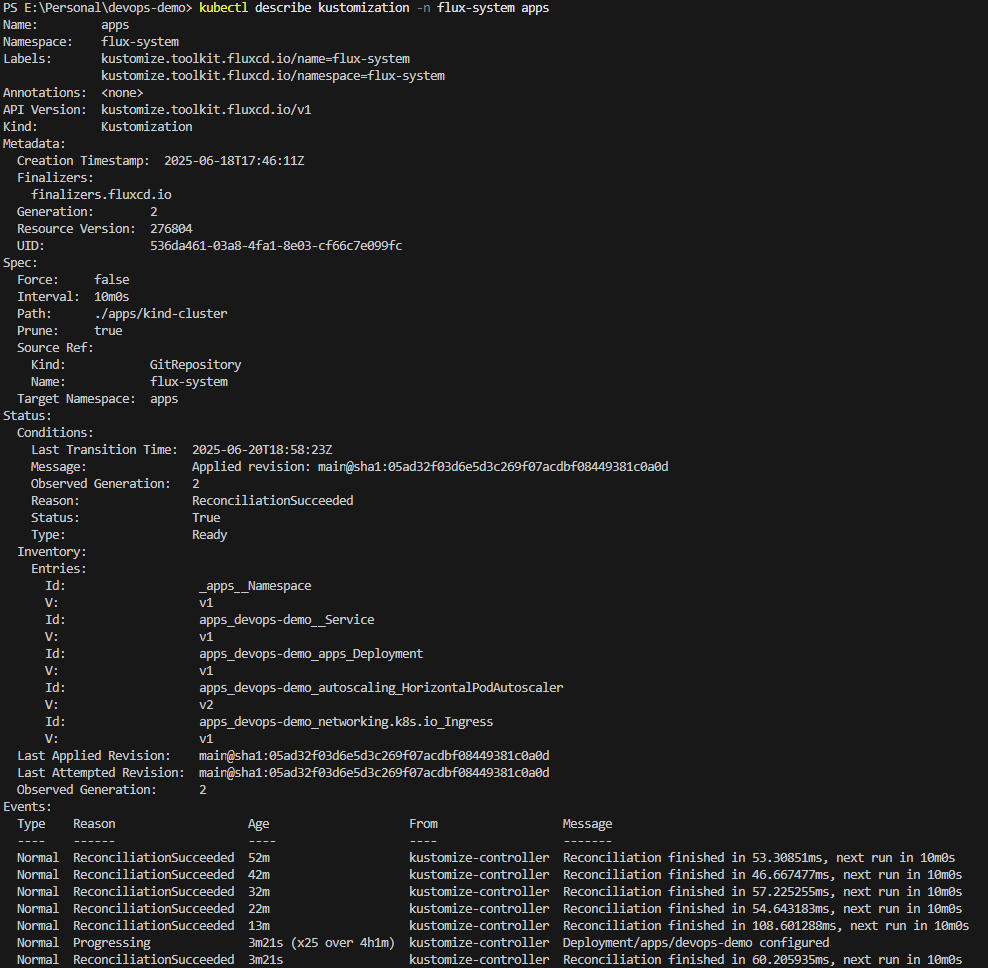

Podemos observar en este *Kustomnization* las referencias al *GitRepository* (en el *Source Ref*), la ubicación (*path*) a desplegar y otras propiedades configurables del mismo. También en la sección de *Status* podemos ver el estado y un inventario de los recursos generados por este *Kustomization*

### Recursos desplegados
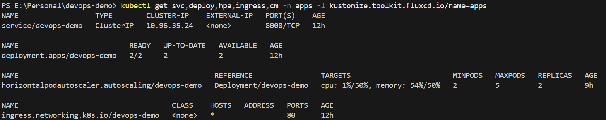

Podemos observar que los recursos han sido desplegados de manera correcta, sin embargo se observa la ausencia de este [*ConfigMap*](kubernetes/base/configmap.yaml). La razón es que al momento de redactar este documento, este no está listado dentro del [*kustomization.yaml*](kubernetes/base/kustomization.yaml). 

### Pipeline y Actualización 
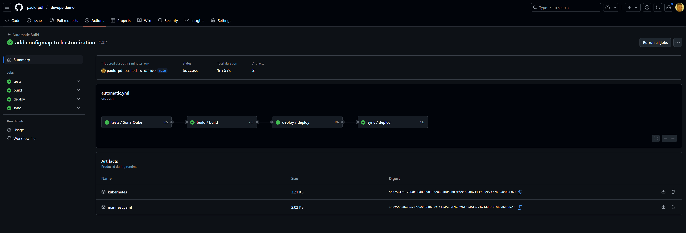

Se puede observar la ejecución correcta del pipeline, posterior a modificar el archivo [*kustomization.yaml*](kubernetes/base/kustomization.yaml), para contemplar el [*ConfigMap*](kubernetes/base/configmap.yaml).
A partir de este punto nos movemos al [repositorio de GitOps](https://github.com/paulorpdldevops-demo-gitops), para las siguientes validaciones. 

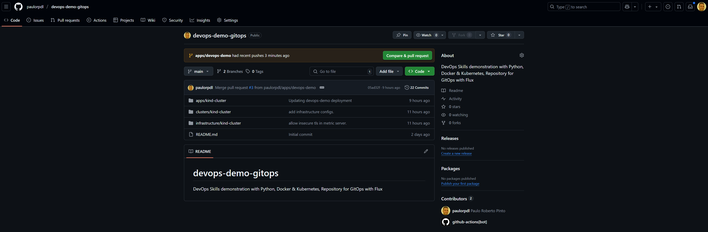

En el mismo se habra creado o actualizado el *branch apps/devops-demo* como se puede observar a continuación y desde el cuál debemos generar un PR.

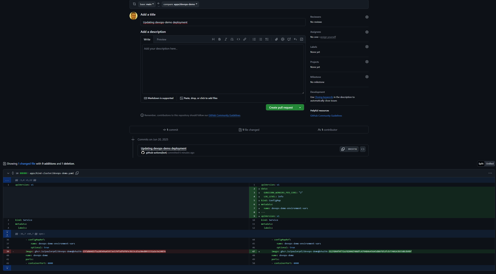

En este PR podemos observar que se adiciona el configmap y se actualiza la imágen del contenedor. Todas las imagenes en este ejercició se referencian por *digest*. A este punto se procede a crear y ejecutar el *merge* del PR.

### Actualización en clúster
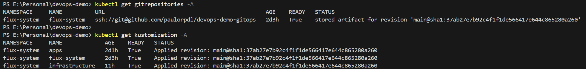

Se observa que el commit id de la revisión ha cambiado y debe coincidir con la que se encuentra en el [repositorio de GitOps](https://github.com/paulorpdldevops-demo-gitops).

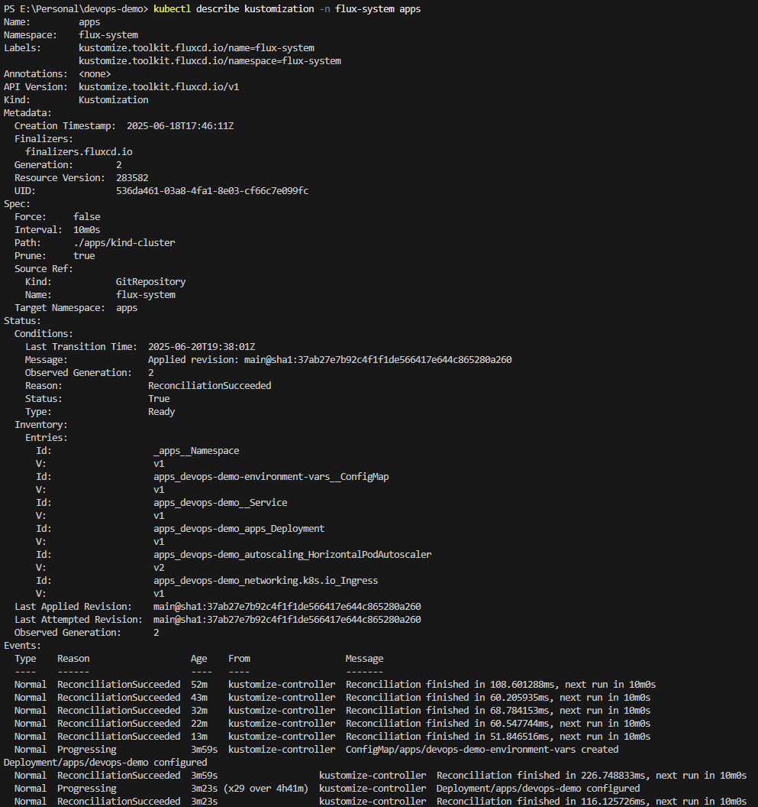

También se observan los cambios en el inventario del *Kustomization*.

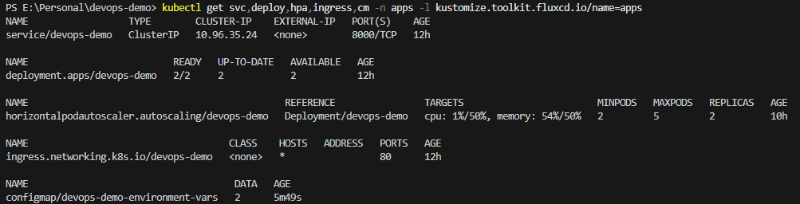

De igual manera al filtrar los recursos creados por el *label* que adiciona el *Kustomization* a todos los recursos que crea, podemos observar que ahora si se observa el *ConfigMap*.

### Pruebas de aplicacion


Utilizando *kubectl port-forward* se habilito el acceso al servicio desplegado para hacer pruebas de creación de recursos como se observa.


De igual forma se valido la obtención de datos existentes en el servicio.

## Observaciones finales

- Como se puede observar a lo largo de este README, para esta demostración se está utilizando Flux. De requerirse más detalles, favor validar la [documentación de Flux](https://fluxcd.io/flux/).
- Para la demostración, se implemento un clúster con Kind haciendo uso de Podman Desktop.
- A lo largo de está demostración se opta por la utilización de terminología generica de containers, en lugar de Docker, sin embargo la implementación es plenamente compatible con Docker, al seguir la especificación OCI. 
- Se pueden obtener los siguientes paquetes públicos generados por este repositorio en:
  - [Image Builds](https://github.com/paulorpdl/devops-demo/pkgs/container/devops-demo)
  - [Flux OCI Archive](https://github.com/paulorpdl/devops-demo/pkgs/container/manifests%2Fdevops-demo)